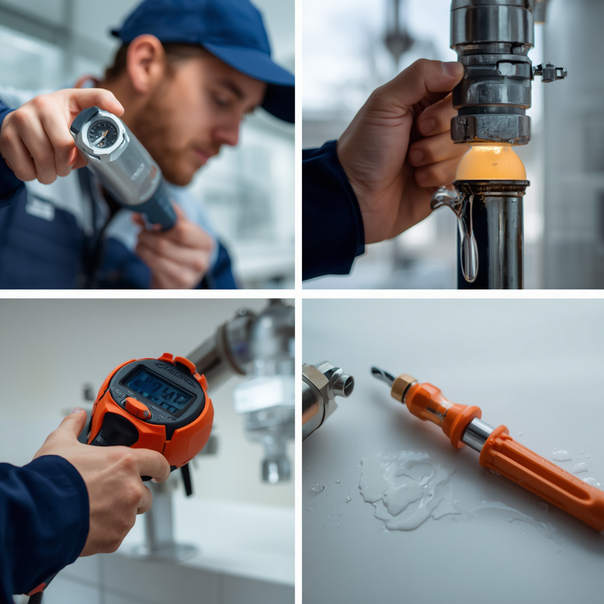

# Service Images Implementation Guide

## Overview
Your services page has been updated to display 6 services with professional product/service images. Each service card now includes an image at the top with the title and description below.

---

## Required Image Files

### Image File Names and Specifications
Place these image files in your `websit/` folder:

| File Name | Service | Recommended Dimensions | File Format |
|-----------|---------|----------------------|-------------|
| service1.jpg | Leak Detection & Pipe Repairs | 400px × 250px | JPG/PNG |
| service2.jpg | Drain Cleaning & Blockage Removal | 400px × 250px | JPG/PNG |
| service3.jpg | Geyser & Water Heater Installation/Repair | 400px × 250px | JPG/PNG |
| service4.jpg | Bathroom & Kitchen Plumbing Installations | 400px × 250px | JPG/PNG |
| service5.jpg | Emergency Plumbing Services | 400px × 250px | JPG/PNG |
| service6.jpg | Water Supply & Pressure Management | 400px × 250px | JPG/PNG |

---

## Services Overview

### Service 1: Leak Detection & Pipe Repairs
**Image suggestions:** Plumber with leak detection equipment, close-up of pipe repair, water damage repair
**Best images:** Professional plumber using inspection tools, copper pipes being repaired

### Service 2: Drain Cleaning & Blockage Removal
**Image suggestions:** High-pressure jetting equipment, before/after drain comparison, plumber with drain rods
**Best images:** Drain cleaning in progress, professional drain inspection

### Service 3: Geyser & Water Heater Installation/Repair
**Image suggestions:** Electric geyser, solar water heater, installation process
**Best images:** New geyser installation, technician working on heater

### Service 4: Bathroom & Kitchen Plumbing Installations
**Image suggestions:** Modern bathroom setup, installed sink, shower installation
**Best images:** Beautiful renovated bathroom, professional kitchen sink installation

### Service 5: Emergency Plumbing Services
**Image suggestions:** Emergency response vehicle, 24/7 service sign, emergency situation resolution
**Best images:** Plumber arriving at property, emergency repair in progress

### Service 6: Water Supply & Pressure Management
**Image suggestions:** Water tank installation, pressure gauge, water distribution system
**Best images:** Water tank installation, pressure management equipment

---

## HTML Code Structure

### Service Card Layout
Each service card now uses this structure:

```html
<div class="service-card">
    <!-- Image displayed at top of card -->
    
    
    <!-- Content section with text -->
    <div class="service-card-content">
        <h3>Leak Detection & Pipe Repairs</h3>
        <p>Service description text here...</p>
    </div>
</div>
```

---

## CSS Styling Applied

### Grid Layout
- **Desktop:** 3 columns (3 services per row)
- **Tablet:** 2 columns (2 services per row)
- **Mobile:** 1 column (full width)

### Image Display
- Width: 100% (fills card width)
- Height: 200px (fixed height for consistent appearance)
- Object-fit: cover (maintains aspect ratio while filling space)
- Rounded corners: 5px top radius

### Card Styling
- Flexbox layout for vertical content flow
- White background (#f8f9fa)
- Blue left border (4px #0066cc)
- Hover shadow effect
- Smooth transitions

---

## Step-by-Step Image Upload Instructions

1. **Prepare Your Images:**
   - Resize images to 400px × 250px (or larger for quality)
   - Optimize file size (compress without losing quality)
   - Use JPG format for photos (smaller file size)
   - Use PNG only if transparency is needed

2. **File Location:**
   ```
   websit/
   ├── index.html
   ├── about.html
   ├── services.html
   ├── enquiry.html
   ├── contact.html
   ├── logo.png
   ├── service1.jpg          ← Add here
   ├── service2.jpg          ← Add here
   ├── service3.jpg          ← Add here
   ├── service4.jpg          ← Add here
   ├── service5.jpg          ← Add here
   ├── service6.jpg          ← Add here
   └── README.md
   ```

3. **Alternative File Names:**
   If you prefer different names, update the src attribute in services.html:
   ```html
   
   ```

---

## Image Optimization Tips

### Compress Images
Use these free online tools:
- **TinyPNG.com** - Great compression without quality loss
- **ImageOptim** - Batch optimization
- **Pixlr.com** - Free online editor for resizing

### Recommended File Sizes
- Original: 1200×750px or larger
- Display: 400×250px
- File size: 50-150 KB per image (after compression)

### Image Quality
- Use high-quality source images
- Avoid blurry or pixelated images
- Ensure good lighting and clear focus
- Professional photos recommended

---

## Alt Text Best Practices

The alt text for each image is already set in the HTML:
- "Pipe leak detection and repair service"
- "Professional drain cleaning service"
- "Geyser and water heater installation"
- "Bathroom and kitchen plumbing installation"
- "24/7 emergency plumbing services"
- "Water supply and pressure management systems"

**Importance:** Alt text helps:
- Screen readers for accessibility
- SEO (search engine optimization)
- Image display if file fails to load

---

## Responsive Design Preview

### Desktop (1200px+)
```
┌─────────────┬─────────────┬─────────────┐
│  Service 1  │  Service 2  │  Service 3  │
├─────────────┼─────────────┼─────────────┤
│  Service 4  │  Service 5  │  Service 6  │
└─────────────┴─────────────┴─────────────┘
```

### Tablet (768px - 1024px)
```
┌─────────────┬─────────────┐
│  Service 1  │  Service 2  │
├─────────────┼─────────────┤
│  Service 3  │  Service 4  │
├─────────────┼─────────────┤
│  Service 5  │  Service 6  │
└─────────────┴─────────────┘
```

### Mobile (< 600px)
```
┌─────────────┐
│  Service 1  │
├─────────────┤
│  Service 2  │
├─────────────┤
│  Service 3  │
├─────────────┤
│  Service 4  │
├─────────────┤
│  Service 5  │
├─────────────┤
│  Service 6  │
└─────────────┘
```

---

## Service Card Dimensions

### Individual Card Size (on Desktop)
- Width: ~320px (1/3 of container minus gaps)
- Image Height: 200px (fixed)
- Content Height: Variable (depends on text)
- Total Height: ~320-400px
- Gap between cards: 30px

---

## Testing the Images

After adding your images, test:

1. **Visual Check:**
   - Images display correctly
   - No broken image icons
   - Proper aspect ratios
   - Good contrast and readability

2. **Responsive Test:**
   - Resize browser window
   - Check grid changes from 3→2→1 columns
   - Test on mobile device

3. **Performance:**
   - Page loads quickly
   - No lag or delay
   - Smooth hover effects work

---

## Troubleshooting

### Images Not Showing
1. Check file names match exactly (case-sensitive)
2. Verify files are in the same folder as HTML files
3. Check file path in src attribute: ``
4. Ensure file format is supported (.jpg, .png, .gif)

### Images Look Stretched
1. Ensure source images are at least 400×250px
2. Images use object-fit: cover (crops to fit)
3. Try using square or landscape images for best results

### Images Load Slowly
1. Compress image files to <150KB
2. Use JPG format for photos (smaller than PNG)
3. Consider using WebP format for better compression
4. Test page speed with Google PageSpeed Insights

---

## Advanced Customization

### Change Image Height
In the CSS, find:
```css
.service-card img {
    width: 100%;
    height: 200px;        ← Adjust this value
    object-fit: cover;
    display: block;
}
```

Change `height: 200px;` to any value (e.g., 250px, 180px)

### Add Image Captions
```html
<div class="service-card">
    
    <div class="service-card-content">
        <p style="font-size: 0.85em; color: #999;">
            Leak Detection & Inspection Equipment
        </p>
        <h3>Leak Detection & Pipe Repairs</h3>
        <p>Service description...</p>
    </div>
</div>
```

### Add Border to Images
Add to CSS:
```css
.service-card img {
    border: 1px solid #0066cc;
}
```

---

## Free Image Sources (Royalty-Free)

### Photography Sites
- **Unsplash.com** - Free professional photos
- **Pexels.com** - Free stock photos
- **Pixabay.com** - Free images and vectors
- **Shutterstock.com** - Premium paid images
- **iStock.com** - Professional stock images

### Image Editing Tools
- **Canva.com** - Free online design tool
- **Pixlr.com** - Free online editor
- **GIMP** - Free desktop software
- **Photoshop** - Professional tool

---

## File Checklist

- [ ] service1.jpg ready (Leak Detection)
- [ ] service2.jpg ready (Drain Cleaning)
- [ ] service3.jpg ready (Geyser/Water Heater)
- [ ] service4.jpg ready (Bathroom/Kitchen)
- [ ] service5.jpg ready (Emergency Services)
- [ ] service6.jpg ready (Water Supply/Pressure)
- [ ] All images copied to websit/ folder
- [ ] services.html uploaded/updated
- [ ] Tested on desktop
- [ ] Tested on tablet
- [ ] Tested on mobile
- [ ] All images load without errors

---

## Next Steps

1. **Gather Images:** Collect or create images for each service
2. **Optimize:** Compress and resize to specifications
3. **Upload:** Place in websit/ folder
4. **Test:** Verify display and responsiveness
5. **Deploy:** Upload services.html and images to server

---

## Summary

Your services page now features:
- ✅ 6 professional service cards
- ✅ High-quality image support (200px height)
- ✅ Responsive grid layout (3→2→1 columns)
- ✅ Professional hover effects
- ✅ Accessible alt text
- ✅ Mobile-optimized

**Last Updated:** 2026-08-13  
**Status:** Ready for Image Implementation